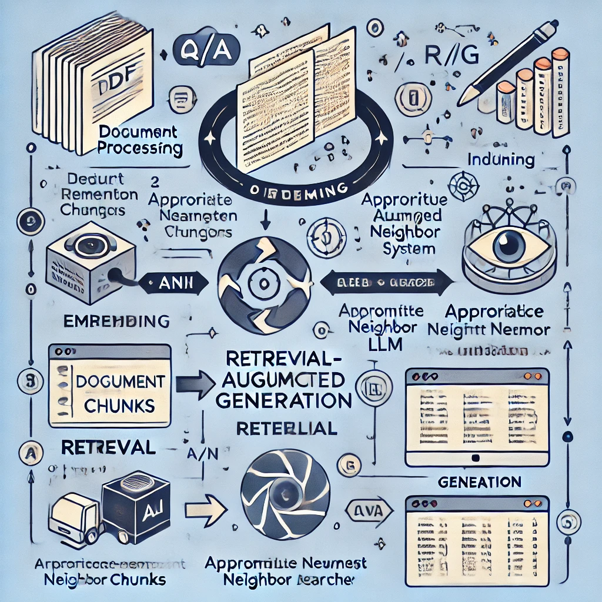

# **Simple Local RAG LLM Model**

An efficient Retrieval-Augmented Generation (RAG) pipeline integrating Google Gemini LLM, Sentence-Transformers, and vector-based search to retrieve and generate contextually relevant answers from PDF documents.

## **Features**
	•	📄 PDF Processing: Extracts and tokenizes text from PDFs for chunking.
	•	🔍 Vector Embeddings & Search: Uses Sentence-Transformers for document chunk embedding and Approximate Nearest Neighbor (ANN) search.
	•	🧠 Google Gemini LLM Integration: Fine-tuned for accurate and high-quality responses.
	•	🤖 Retrieval-Augmented Generation (RAG): Enhances LLM-generated answers with retrieved document content for improved relevance.

📂 Installation

git clone [https://github.com/yourusername/Simple-Local-RAG-LLM.git ](https://github.com/97shivank/Simple-Local-RAG-LLM) 
cd Simple-Local-RAG-LLM  
pip install -r requirements.txt

📜 Usage

1️⃣ Download & Extract Text from PDF

from utils import open_and_read_pdf  
pages_and_texts = open_and_read_pdf("your_document.pdf")  

2️⃣ Embed & Index Chunks

from sentence_transformers import SentenceTransformer  
model = SentenceTransformer("all-MiniLM-L6-v2")  
embeddings = model.encode([chunk["text"] for chunk in pages_and_texts])  

3️⃣ Query & Retrieve Relevant Chunks

from similarity_search import retrieve_relevant_chunks  
relevant_chunks = retrieve_relevant_chunks(query="What is human nutrition?", embeddings, pages_and_texts)  

4️⃣ Generate Responses using Google Gemini LLM

from llm import generate_response  
response = generate_response(relevant_chunks)  
print(response)  

⚙️ Tech Stack
	•	Python, Sentence-Transformers, FAISS, Google Gemini API
	•	RAG (Retrieval-Augmented Generation) Pipeline

🏗️ Future Enhancements
	•	✅ Support for multiple document formats (TXT, DOCX, HTML).
	•	✅ UI-based query interface.

📜 License

This project is licensed under the MIT License.
